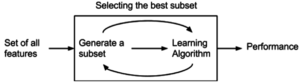
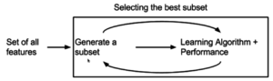

# Feature Selection

## Introduction

You've now learned about many different ways to create features to model more complex relationships. If you included interaction terms between all of your variables and high order polynomial functions, you will no doubt have an issue with overfitting to noise. In this lesson, you'll learn about the different techniques you can use to only use features that are most relevant to your model.

### Objectives

You will be able to:

* List the different methods of feature selection
* Identify when it is appropriate to use certain methods of feature selection
* Use feature selection on a dataset
* Demonstrate how different methods of feature selection are performed

### Purpose of Feature Selection

Feature selection is the process by which you select a subset of features relevant for model construction. Feature Selection comes with several benefits, the most obvious being the improvement of a machine learning algorithm. Other benefits include:

* Decrease in computational complexity: As the number of features are reduced in a model, the easier it will be to compute the parameters of your model. It will also mean a decrease in the amount of data storage required to maintain the features of your model.
* Understanding your data: In the process of feature selection, you will gain more of an understanding of how features relate to one another.

Now, let's look at the different types of feature selection and their advantages/disadvantages.

### Types of Feature Selection

Like many things in data science there is not a clear and easy answer for deciding what features to include in a model. There are however, different strategies you can use to process in the correct manner.


* Domain Knowledge
* Wrapper Methods
* Filter Methods
* Embedded Methods


#### Domain Knowledge   
One of the first steps a data scientist should take when trying to determine what types of features might be useful is knowledge of the specific domain related to your dataset. This might mean reading past research papers that have explored similar topics or asking to key stakeholders to determine what the believe the most important factors are for predicting something.


#### Wrapper Methods   
Wrapper methods determine the optimal subset of features using different combinations of features to train models and then calculating performance. Every subset is used to train models and then evaluated on a test test. As you might imagine, wrapper methods can end up being very computationally intensive, however they are highly effective in determining the optimal subset. Because wrapper methods are so time-consuming, it becomes challenging to use them with large feature sets. 



An example of a wrapper method in linear regression is Recursive Feature Elimination, which starts with all features included in a model and removes them one by one. After the model has had a feature removed, whichever subset of features resulted in the least statistically significant deterioration of the model fit will indicate which omitted feature is the least useful for prediction. The opposite of this process is Forward Selection, which undergoes the same process in reverse. It begins with a single feature and continues to add the next feature that improves model performance the most. 

#### Filter Methods   
Filter methods are feature selection methods carried out as a pre-processing step before even running a model. Filter methods work by observing characteristics of how variables are related to one another. Depending on the model that is being used, different metrics are used to determine which features will get eliminated and which will remain. Typically, filter methods will return a "feature ranking" that will tell you how features are ordered in relation to one another. They will remove the variables that are considered redundant. It's up to the data scientist to determine the cut-off point at which they will keep the top n features, and this n is usually determined through cross validation.


In the linear regression context, a common filter method is to eliminate features that are two highly correlated with one another. Another method is to use a variance threshold. This sets some threshold of required variance for features in order to include them in a model. The though process behind this is that if variables do not have a high variance, they will not change much and will therefore not have much impact on our dependent variable.


#### Embedded methods   
Embedded methods are feature selection methods that are included within the actual formulation of your machine learning algorithm. The most common kind of embedded method is regularization, in particular Lasso, because it has the capability of reducing your set of features automatically.



Let's see a wrapper method in action on the diabetes dataset built into scikit-learn. The dataset contains the independent variables age, sex, body mass index, blood pressure, and 6 different blood serum measurements. The target variable represents a quantitative measurement progression of diabetes from one year after a baseline observation. 

### Processing the Data

To begin with, we are going to preprocess the data to ensure that each one of the columns


```python
import pandas as pd
import numpy as np
from matplotlib import pyplot as plt
from sklearn import datasets, linear_model
from sklearn.model_selection import train_test_split
from sklearn import metrics
from sklearn.linear_model import LinearRegression

df = pd.read_csv('diabetes.tab.txt', sep='\t', lineterminator='\n')

```


```python
# obtaining the X and Y variables from the dataframe
features = df.iloc[:,:-1]
target = df['Y']
# creating dummy variable for sex
features['female'] = pd.get_dummies(features['SEX'],drop_first=True)
features.drop(columns=['SEX'], inplace=True)
features.head()
```


<div>
<style scoped>
    .dataframe tbody tr th:only-of-type {
        vertical-align: middle;
    }

    .dataframe tbody tr th {
        vertical-align: top;
    }

    .dataframe thead th {
        text-align: right;
    }
</style>
<table border="1" class="dataframe">
  <thead>
    <tr style="text-align: right;">
      <th></th>
      <th>AGE</th>
      <th>BMI</th>
      <th>BP</th>
      <th>S1</th>
      <th>S2</th>
      <th>S3</th>
      <th>S4</th>
      <th>S5</th>
      <th>S6</th>
      <th>female</th>
    </tr>
  </thead>
  <tbody>
    <tr>
      <th>0</th>
      <td>59</td>
      <td>32.1</td>
      <td>101.0</td>
      <td>157</td>
      <td>93.2</td>
      <td>38.0</td>
      <td>4.0</td>
      <td>4.8598</td>
      <td>87</td>
      <td>1</td>
    </tr>
    <tr>
      <th>1</th>
      <td>48</td>
      <td>21.6</td>
      <td>87.0</td>
      <td>183</td>
      <td>103.2</td>
      <td>70.0</td>
      <td>3.0</td>
      <td>3.8918</td>
      <td>69</td>
      <td>0</td>
    </tr>
    <tr>
      <th>2</th>
      <td>72</td>
      <td>30.5</td>
      <td>93.0</td>
      <td>156</td>
      <td>93.6</td>
      <td>41.0</td>
      <td>4.0</td>
      <td>4.6728</td>
      <td>85</td>
      <td>1</td>
    </tr>
    <tr>
      <th>3</th>
      <td>24</td>
      <td>25.3</td>
      <td>84.0</td>
      <td>198</td>
      <td>131.4</td>
      <td>40.0</td>
      <td>5.0</td>
      <td>4.8903</td>
      <td>89</td>
      <td>0</td>
    </tr>
    <tr>
      <th>4</th>
      <td>50</td>
      <td>23.0</td>
      <td>101.0</td>
      <td>192</td>
      <td>125.4</td>
      <td>52.0</td>
      <td>4.0</td>
      <td>4.2905</td>
      <td>80</td>
      <td>0</td>
    </tr>
  </tbody>
</table>
</div>


```python
from sklearn import preprocessing
X_train, X_test, y_train, y_test = train_test_split(features, target, random_state=20,test_size=0.2)
scaler = preprocessing.StandardScaler()

## scaling every feature except the binary column female

scaler.fit(X_train.iloc[:,:-1])
transformed_training_features = scaler.transform(X_train.iloc[:,:-1])
transformed_testing_features = scaler.transform(X_test.iloc[:,:-1])

X_train_transformed = pd.DataFrame(scaler.transform(X_train.iloc[:,:-1]), columns=X_train.columns[:-1], index=X_train.index)
X_train_transformed['female'] = X_train['female']

X_test_transformed = pd.DataFrame(scaler.transform(X_test.iloc[:,:-1]), columns=X_train.columns[:-1], index=X_test.index)
X_test_transformed['female'] = X_test['female']
```

Before we start subsetting features, we should see how well the model performs without performing any kind of transformations to the data.


```python
lm = LinearRegression()
lm.fit(X_train_transformed,y_train)


y_pred = lm.predict(X_test_transformed)
print('Root Mean Square Error',np.sqrt(metrics.mean_squared_error(y_test,y_pred)))
print('R^2 value', lm.score(X_test_transformed,y_test))
```

    Root Mean Square Error 58.83589708889504
    R^2 value 0.4179775463198647


The model has not performed exceptionally well here, so we can try adding some additional features. Let's go ahead and add a polynomial degree of up to 3.


```python
poly = preprocessing.PolynomialFeatures(degree=3, interaction_only=False, include_bias=False)
X_poly_train = pd.DataFrame(poly.fit_transform(X_train_transformed), columns=poly.get_feature_names(features.columns))
X_poly_test = pd.DataFrame(poly.transform(X_test_transformed), columns=poly.get_feature_names(features.columns))
X_poly_train.head()
```


<div>
<style scoped>
    .dataframe tbody tr th:only-of-type {
        vertical-align: middle;
    }

    .dataframe tbody tr th {
        vertical-align: top;
    }

    .dataframe thead th {
        text-align: right;
    }
</style>
<table border="1" class="dataframe">
  <thead>
    <tr style="text-align: right;">
      <th></th>
      <th>AGE</th>
      <th>BMI</th>
      <th>BP</th>
      <th>S1</th>
      <th>S2</th>
      <th>S3</th>
      <th>S4</th>
      <th>S5</th>
      <th>S6</th>
      <th>female</th>
      <th>...</th>
      <th>S5^3</th>
      <th>S5^2 S6</th>
      <th>S5^2 female</th>
      <th>S5 S6^2</th>
      <th>S5 S6 female</th>
      <th>S5 female^2</th>
      <th>S6^3</th>
      <th>S6^2 female</th>
      <th>S6 female^2</th>
      <th>female^3</th>
    </tr>
  </thead>
  <tbody>
    <tr>
      <th>0</th>
      <td>-0.433522</td>
      <td>-0.967597</td>
      <td>-2.067847</td>
      <td>-1.623215</td>
      <td>-1.280312</td>
      <td>-0.347527</td>
      <td>-0.852832</td>
      <td>-1.095555</td>
      <td>-1.006077</td>
      <td>0.0</td>
      <td>...</td>
      <td>-1.314929</td>
      <td>-1.207535</td>
      <td>0.000000</td>
      <td>-1.108911</td>
      <td>0.000000</td>
      <td>-0.000000</td>
      <td>-1.018343</td>
      <td>0.000000</td>
      <td>-0.000000</td>
      <td>0.0</td>
    </tr>
    <tr>
      <th>1</th>
      <td>1.117754</td>
      <td>-0.516691</td>
      <td>1.142458</td>
      <td>-0.168101</td>
      <td>-0.129601</td>
      <td>-0.424950</td>
      <td>-0.083651</td>
      <td>0.543382</td>
      <td>-0.831901</td>
      <td>1.0</td>
      <td>...</td>
      <td>0.160442</td>
      <td>-0.245631</td>
      <td>0.295264</td>
      <td>0.376053</td>
      <td>-0.452040</td>
      <td>0.543382</td>
      <td>-0.575725</td>
      <td>0.692060</td>
      <td>-0.831901</td>
      <td>1.0</td>
    </tr>
    <tr>
      <th>2</th>
      <td>1.350445</td>
      <td>1.850570</td>
      <td>1.427819</td>
      <td>0.413945</td>
      <td>0.764667</td>
      <td>-1.044334</td>
      <td>1.454710</td>
      <td>0.597504</td>
      <td>1.519478</td>
      <td>1.0</td>
      <td>...</td>
      <td>0.213315</td>
      <td>0.542470</td>
      <td>0.357011</td>
      <td>1.379524</td>
      <td>0.907894</td>
      <td>0.597504</td>
      <td>3.508190</td>
      <td>2.308813</td>
      <td>1.519478</td>
      <td>1.0</td>
    </tr>
    <tr>
      <th>3</th>
      <td>-0.511086</td>
      <td>-1.373413</td>
      <td>-1.711146</td>
      <td>-0.837453</td>
      <td>-1.148802</td>
      <td>1.278358</td>
      <td>-1.622013</td>
      <td>-0.796071</td>
      <td>-0.918989</td>
      <td>0.0</td>
      <td>...</td>
      <td>-0.504494</td>
      <td>-0.582390</td>
      <td>0.000000</td>
      <td>-0.672315</td>
      <td>0.000000</td>
      <td>-0.000000</td>
      <td>-0.776124</td>
      <td>0.000000</td>
      <td>-0.000000</td>
      <td>0.0</td>
    </tr>
    <tr>
      <th>4</th>
      <td>-0.743778</td>
      <td>0.114579</td>
      <td>-0.141664</td>
      <td>-1.565010</td>
      <td>-1.339491</td>
      <td>-0.115257</td>
      <td>-0.852832</td>
      <td>-0.970101</td>
      <td>0.648597</td>
      <td>1.0</td>
      <td>...</td>
      <td>-0.912957</td>
      <td>0.610391</td>
      <td>0.941095</td>
      <td>-0.408100</td>
      <td>-0.629204</td>
      <td>-0.970101</td>
      <td>0.272850</td>
      <td>0.420678</td>
      <td>0.648597</td>
      <td>1.0</td>
    </tr>
  </tbody>
</table>
<p>5 rows × 285 columns</p>
</div>


As you can see, this has now created 285 total columns! You can imagine that this model will greatly overfit to the data. Let's try it out with our training and test set.


```python
def run_model(model,X_train,X_test,y_train,y_test):
    
    print('Training R^2 :',model.score(X_train,y_train))
    y_pred_train = model.predict(X_train)
    print('Root Mean Square Error',np.sqrt(metrics.mean_squared_error(y_train,y_pred_train)))
    print('Testing R^2 :',model.score(X_test,y_test))
    y_pred_test = model.predict(X_test)
    print('Root Mean Square Error',np.sqrt(metrics.mean_squared_error(y_test,y_pred_test)))

```


```python
lr_poly = LinearRegression()
lr_poly.fit(X_poly_train,y_train)

run_model(lr_poly,X_poly_train,X_poly_test,y_train,y_test)
```

    Training R^2 : 0.8911860273472961
    Root Mean Square Error 25.32084354998492
    Testing R^2 : -12.110251404504968
    Root Mean Square Error 279.2402510921638


Clearly, the model has fit very well to the training data, but it has fit to a lot of noise. The $R^{2}$ is an abysmal -12! It's time to get rid of some features to see if this improves the model.

#### Filter Methods  
Let's begin by trying out some filter methods for feature selection. The benefit of filter methods is that they can provide us with some useful visualizations for helping us gain an understanding about characteristics of our data. To begin with, let's use a simple variance threshold to eliminate those features with a low variance.


```python
from sklearn.feature_selection import VarianceThreshold

threshold_ranges = np.linspace(0,5,num=6)
selector = VarianceThreshold(threshold = 5)
selector.fit(X_poly_train)
```


    VarianceThreshold(threshold=5)


```python
for thresh in threshold_ranges:
    print(thresh)
    selector = VarianceThreshold(thresh)
    reduced_feature_train = selector.fit_transform(X_poly_train)
    reduced_feature_test = selector.transform(X_poly_test)
    lr = LinearRegression()
    lr.fit(reduced_feature_train,y_train)
    run_model(lr,reduced_feature_train,reduced_feature_test,y_train,y_test)
    print('--------------------------------------------------------------------')
```

    0.0
    Training R^2 : 0.8911860273471994
    Root Mean Square Error 25.32084354999617
    Testing R^2 : -12.110251404063117
    Root Mean Square Error 279.24025108745826
    --------------------------------------------------------------------
    1.0
    Training R^2 : 0.7599467559542592
    Root Mean Square Error 37.60881299509217
    Testing R^2 : -0.8374881977001354
    Root Mean Square Error 104.54055202273267
    --------------------------------------------------------------------
    2.0
    Training R^2 : 0.6165364010941058
    Root Mean Square Error 47.53329371052904
    Testing R^2 : 0.13147157040839996
    Root Mean Square Error 71.87279420884137
    --------------------------------------------------------------------
    3.0
    Training R^2 : 0.5396785340715374
    Root Mean Square Error 52.07945737747569
    Testing R^2 : 0.14176747185284266
    Root Mean Square Error 71.44551898683407
    --------------------------------------------------------------------
    4.0
    Training R^2 : 0.49906158604029605
    Root Mean Square Error 54.328536354398594
    Testing R^2 : 0.20744165818270344
    Root Mean Square Error 68.65752292574793
    --------------------------------------------------------------------
    5.0
    Training R^2 : 0.45978340220443226
    Root Mean Square Error 56.4182743723726
    Testing R^2 : 0.2082443514205432
    Root Mean Square Error 68.62274637526733
    --------------------------------------------------------------------


Hmmm, that did not seem to eliminate the features very well.

##### Wrapper Methods

Now let's use RFE to try out a wrapper method


```python
from sklearn.feature_selection import RFE
from sklearn.linear_model import LinearRegression
lm = LinearRegression()
rfe = RFE(lm,n_features_to_select=10)
rfe.fit(features_64_train,y_train)
```


    RFE(estimator=LinearRegression(copy_X=True, fit_intercept=True, n_jobs=1, normalize=False),
      n_features_to_select=10, step=1, verbose=0)


```python
lm2 = LinearRegression()
lm2.fit(features_64_train,y_train)
lm2.score(features_64_test,y_test)
```


    0.36886944442517255


```python
rfe.score(features_64_test,y_test)
```


    0.3741776137528098


So with Recursive Feature Elimination, we went from an $R^2$ score of -12 (which is extremely bad!) to 0.39, which is still not that great.

#### Embedded Methods  
To compare to our other methods, we will use lasso


```python
from sklearn.linear_model import LassoCV

lasso = LassoCV(max_iter=100000)

lasso.fit(X_train_transformed,y_train)
```


    LassoCV(alphas=None, copy_X=True, cv=None, eps=0.001, fit_intercept=True,
        max_iter=100000, n_alphas=100, n_jobs=1, normalize=False,
        positive=False, precompute='auto', random_state=None,
        selection='cyclic', tol=0.0001, verbose=False)


```python
lasso.score(X_test_transformed,y_test)

ru
```


    0.42907158065336737


```python
lasso = LassoCV(max_iter=100000)

lasso.fit(X_train_transformed,y_train)
run_model(lasso,X_train_transformed,X_test_transformed,y_train,y_test)
```

    Training R^2 : 0.5293615658171946
    Root Mean Square Error 52.65983961601151
    Testing R^2 : 0.42907158065336737
    Root Mean Square Error 58.27245842836699


As we can see, the regularization had minimal effect on the performance of the model.

Sources: [Feature Selection](https://www.researchgate.net/profile/Amparo_Alonso-Betanzos/publication/221252792_Filter_Methods_for_Feature_Selection_-_A_Comparative_Study/links/543fd9ec0cf21227a11b8e05.pdf)


[An Introduction to Variable and Feature Selection](http://www.jmlr.org/papers/volume3/guyon03a/guyon03a.pdf)

## Summary

This lesson formalized the different types of feature selection and introduced some new techniques to you. In the next lab, you'll get a chance to test out these feature selection methods to make the optimal model.
